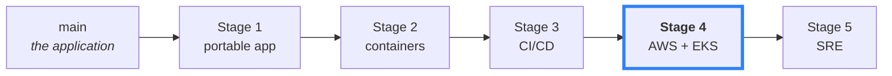
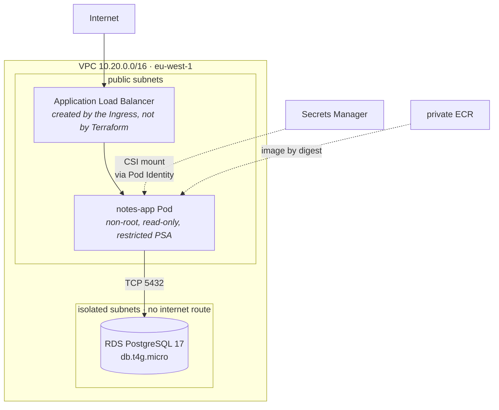
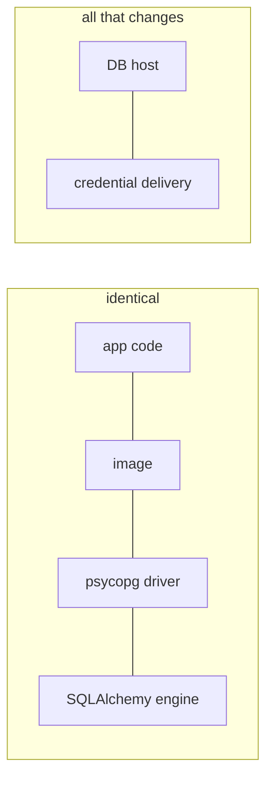
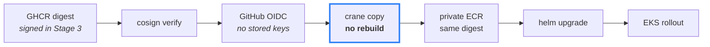

# Notes API

A deliberately small FastAPI application, used as the starting point for a journey from *"it runs on my laptop"* to *"it runs in production."*

Each stage of that journey lives on its own branch, and the **git history is the course** — every commit is one deliberate step.



**You are on Stage 4** (`devops/04-cloud-infrastructure`): the trusted artefact from Stage 3 gets somewhere real to run — a VPC, an EKS cluster, an ALB, and a managed PostgreSQL database, all defined in Terraform and deployed by GitHub Actions with **no stored AWS credentials**.

## The architecture



No NAT gateway, no public database, and the password never becomes an environment variable — it arrives as a **file** the Secrets Store CSI driver mounts into the Pod.

## The database change is boring, on purpose

```bash
git diff --stat devops/03-cicd..devops/04-cloud-infrastructure -- app/ tests/ pyproject.toml
```

That prints **nothing**. This entire stage changes zero lines of application code.



The app became database-agnostic in Stage 1, developers ran it on PostgreSQL from Stage 2, and CI proved both backends from Stage 3. So RDS is a **different hostname**, not a migration. Every problem you hit here is a networking, IAM, or secrets problem — which is exactly what you came to learn.

## Build once, promote many



The bytes deployed to EKS are the bytes that were scanned, tested and signed. Nothing is rebuilt for AWS, and Kubernetes deploys **by digest**, never by tag — the Helm chart refuses to render without one.

## Bring it up

```bash
cd infra/environments/staging && terraform apply   # VPC, EKS, node group, RDS, ECR, IAM
cd ../../platform/staging     && terraform apply   # LB controller, Secrets CSI driver
aws eks update-kubeconfig --region eu-west-1 --name notes-app-staging
```

Then deploy the trusted image (CI does the promotion; nothing is built locally):

```bash
git tag stage4-deploy-N && git push origin stage4-deploy-N
kubectl -n notes-app get pods,ingress
```

> 💸 This is a real AWS account. Roughly **$0.20/hour** with EKS, a `t3.small` node, RDS and an ALB. Tear down when you're done — order matters, see [cloud-learning/17](cloud-learning/17-costs-production-tradeoffs-and-teardown.md).

## Deliberate trade-offs

| Choice | Why | Production would |
|---|---|---|
| EKS, not ECS Fargate | the course is about Kubernetes | genuinely reconsider — see [lesson 02](cloud-learning/02-ecs-vs-eks-choosing-a-runtime.md) |
| No NAT gateway | ~$32/month for a sandbox | add one, keep nodes private |
| Public EKS endpoint | no bastion in a sandbox | private endpoint + VPN |
| Single-AZ RDS, 1-day backups | Free Tier limits | Multi-AZ, longer retention, deletion protection |
| No managed observability | it bills per metric | Stage 5 adds self-managed Prometheus/Grafana |

Accepted scanner findings are documented one-by-one in [`.trivyignore.yaml`](.trivyignore.yaml) — never blanket-suppressed.

## What this stage added

| | |
|---|---|
| **`infra/`** | S3-backed state, VPC, EKS 1.36, managed node group, RDS, ECR, IAM/OIDC |
| **`k8s/`** | Helm chart with digest enforcement, Pod Identity, CSI secret mount |
| **Access** | EKS Access Entries (not `aws-auth`), Pod Identity (not IRSA) |
| **Deploy** | `deploy-staging.yml` — verify signature → OIDC → promote → `helm upgrade` |

## Next

📘 **[cloud-learning/](cloud-learning/)** — the 18-lesson course for this stage, including an honest look at why ECS might have been the better call.

📄 **[README-extended.md](README-extended.md)** — the long version, with full rationale.

▶️ **Stage 5** — SRE and self-managed observability. Not in this repository yet.
