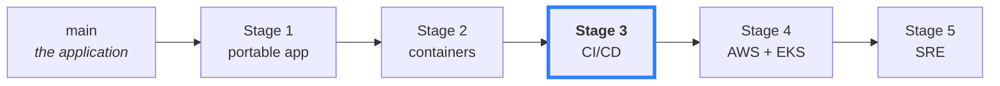
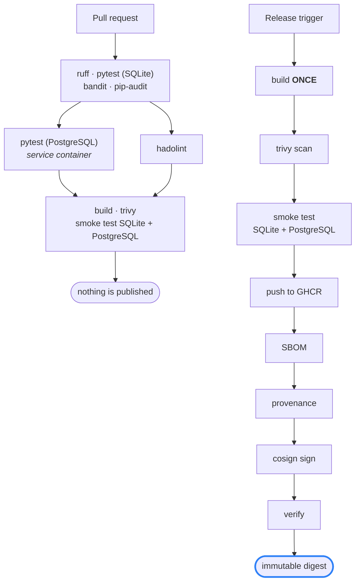
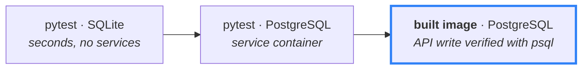
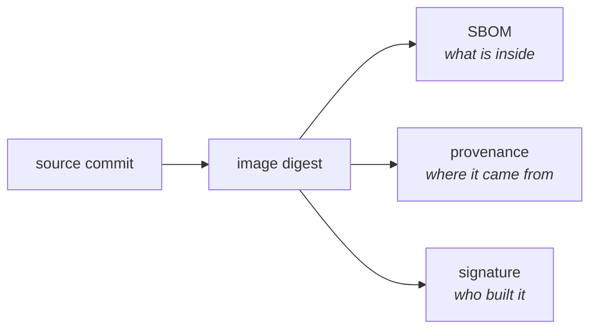

# Notes API

A deliberately small FastAPI application, used as the starting point for a journey from *"it runs on my laptop"* to *"it runs in production."*

Each stage of that journey lives on its own branch, and the **git history is the course** — every commit is one deliberate step.



**You are on Stage 3** (`devops/03-cicd`): every gate Stage 2 taught you to run by hand now runs automatically, on real GitHub Actions, against this actual repository — including a genuine failure that had to be found and fixed.

## Two pipelines



A pull request proves the image *can* be built and works. Only a release publishes — and it publishes **the exact image it just tested**, never a rebuild.

## Two test tiers



The same test files run twice — only `DATABASE_URL` changes. The strongest check is the third: the artefact about to be published is run against a real database, and the row it writes over HTTP is read back out with `psql`.

SQLite keeps the inner loop fast; PostgreSQL keeps the fidelity honest. **Parity is not identity** — CI is the right place to pay for the slow one.

## Trust, not just automation



Keyless signing via GitHub's OIDC token — **no private key exists anywhere**. Verification checks the signature was made by *this repository's release workflow*, not merely by "someone":

```bash
cosign verify \
  --certificate-identity-regexp "^https://github.com/<owner>/<repo>/\.github/workflows/release\.yml@.*$" \
  --certificate-oidc-issuer "https://token.actions.githubusercontent.com" \
  ghcr.io/<owner>/<repo>@sha256:<digest>
```

## Look at the real runs

```bash
gh run list --limit 10
gh run view <id> --log
```

Nothing in this stage is illustrative YAML. Every workflow here has been executed, observed, and fixed where it broke.

## What this stage added

| | |
|---|---|
| **`pr-checks.yml`** | lint, tests on both databases, Dockerfile lint, build, scan, two smoke tests |
| **`release.yml`** | build once → scan → test → GHCR → SBOM → provenance → sign → verify |
| **`infra-checks.yml`** | (from Stage 4) Terraform and Helm validation, no AWS credentials |
| **Hardening** | every action pinned to a commit SHA, least-privilege `permissions:`, concurrency control |
| **`dependabot.yml`** | automated dependency and action updates |

## Next

📘 **[cicd-learning/](cicd-learning/)** — the 17-lesson course for this stage, from pipeline triggers to signing, provenance, and debugging CI for real.

📄 **[README-extended.md](README-extended.md)** — the long version, with full rationale.

▶️ **Stage 4** — `devops/04-cloud-infrastructure`, where this trusted digest gets promoted into AWS and actually runs.
