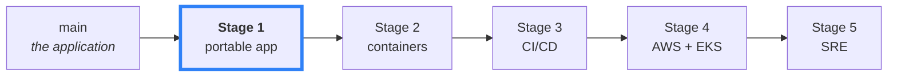
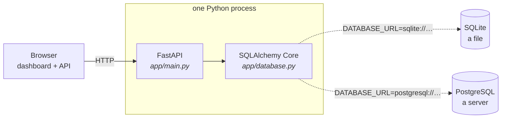

# Notes API

A deliberately small FastAPI application, used as the starting point for a journey from *"it runs on my laptop"* to *"it runs in production."*

Each stage of that journey lives on its own branch, and the **git history is the course** — every commit is one deliberate step.



**You are on Stage 1** (`devops/01-pre-containerisation`): you have inherited someone else's application. Before it can be containerised, it has to be understood, cleaned up, and made portable. No `Dockerfile` here — that is the whole point.

## Architecture



The application never learns which database it is using. **One environment variable decides** — no code change, no separate build, no `if cloud:` branch anywhere.

## Run it

```bash
python -m venv .venv && source .venv/bin/activate
pip install -e ".[dev]"
cp .env.example .env
uvicorn app.main:app --reload
```

Dashboard at <http://127.0.0.1:8000>, docs at `/docs`, tests with `pytest`.

## Choose a database

```bash
DATABASE_URL=sqlite:///./notes.db                                   # default — no server needed
DATABASE_URL=postgresql+psycopg://notes:pw@localhost:5432/notes     # a real server
```

Ask the app which one it actually reached:

```bash
curl -s localhost:8000/ready
# {"status":"ready","database":"sqlite"}
```

SQLite is the default *on purpose* — instant, serverless, and perfect for a fast test loop. PostgreSQL is equally supported for anyone who wants production fidelity locally. Neither is the "real" one.

> Where a password must not sit inside a URL, supply `DB_HOST`/`DB_PORT`/`DB_NAME`/`DB_USER` plus `DB_PASSWORD_FILE` instead. `DATABASE_URL` always wins; see [`.env.example`](.env.example).

## API

| Method | Path | |
|---|---|---|
| `GET` `POST` | `/notes` | list / create |
| `GET` `PUT` `DELETE` | `/notes/{id}` | read / update / delete |
| `GET` | `/health` | liveness — never touches the database |
| `GET` | `/ready` | readiness — checks the database, reports the backend |

## What this stage added

| | |
|---|---|
| **Configuration** | every setting from the environment (`app/config.py`, `.env.example`) |
| **Secrets** | refuses to start in production without `APP_SECRET`; passwords readable from a file |
| **Database portability** | SQLAlchemy Core, `DATABASE_URL`, PostgreSQL driver already installed |
| **Operability** | split liveness/readiness, structured log level, clear 503 on database failure |

Earlier commits on this branch deliberately *introduce* realistic problems tagged `TRAINING-ISSUE`; later commits fix them. To do the investigation yourself, check out a commit before **"Fix static analysis findings"**.

## Next

📘 **[devops-learning/](devops-learning/)** — the 15-lesson course for this stage, from "what have I been handed?" to a completed pre-containerisation review.

📄 **[README-extended.md](README-extended.md)** — the long version, with full rationale.

▶️ **Stage 2** — `devops/02-containerisation-supply-chain`, where this becomes a hardened, scanned, signed container image.
