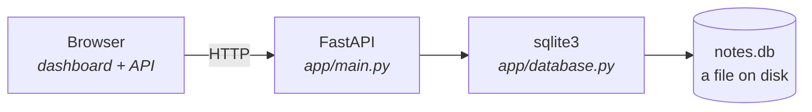
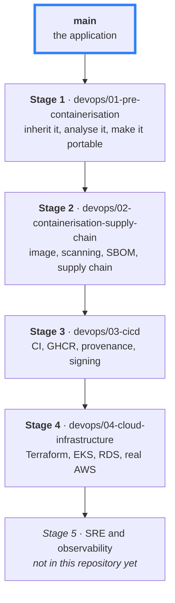

# Notes API

A deliberately small FastAPI application — the starting point for a journey from *"it runs on my laptop"* to *"it runs in production."*

It does almost nothing on purpose. No configuration, no containers, no pipeline, no cloud. Those arrive one stage at a time, on their own branches, so that each one shows up **only once the problem it solves is real**.

## The application



That is the whole system: one process, one file. Everything else in this repository is about what happens to it next.

## Run it

```bash
python -m venv .venv && source .venv/bin/activate
pip install -e ".[dev]"
uvicorn app.main:app --reload
```

Dashboard at <http://127.0.0.1:8000>, interactive docs at `/docs`, tests with `pytest`.

## API

| Method | Path | |
|---|---|---|
| `GET` `POST` | `/notes` | list / create |
| `GET` `PUT` `DELETE` | `/notes/{id}` | read / update / delete |

```json
{ "id": 1, "title": "Groceries", "content": "Milk, eggs", "created_at": "2026-08-25 12:00:00" }
```

## The journey

Each stage is a branch. The **git history is the course** — every commit is one deliberate step, meant to be read.



| Branch | Course | Lessons |
|---|---|---|
| `main` | [learning/](learning/) — build this app from an empty folder | 22 |
| `devops/01-…` | [devops-learning/](devops-learning/) — receive and prepare an inherited app | 15 |
| `devops/02-…` | [container-learning/](container-learning/) — containers and software supply chain | 27 |
| `devops/03-…` | [cicd-learning/](cicd-learning/) — CI/CD, registries, signing, provenance | 17 |
| `devops/04-…` | [cloud-learning/](cloud-learning/) — AWS, Terraform, Kubernetes, EKS | 18 |

You don't have to finish one to start the next, but each assumes what the last one built.

```bash
git switch devops/01-pre-containerisation
git log --oneline --reverse main..HEAD
```

📄 More detail: **[README-extended.md](README-extended.md)**.
