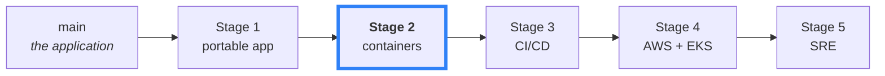
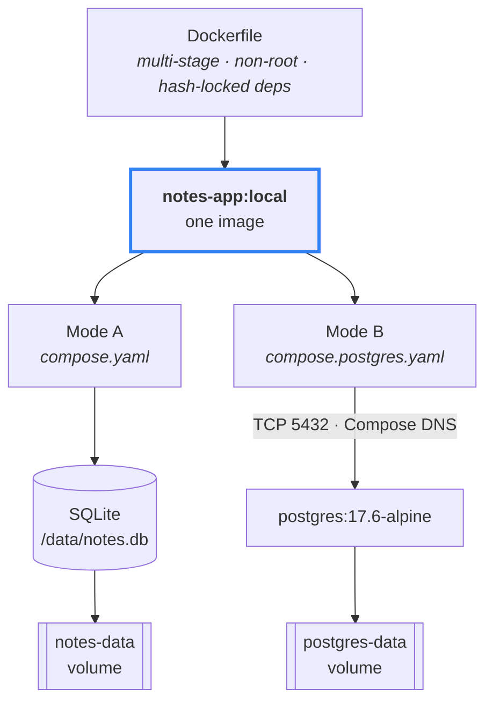
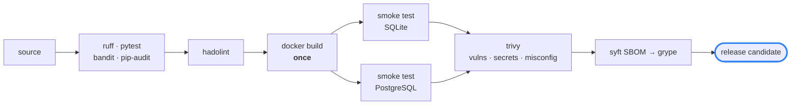

# Notes API

A deliberately small FastAPI application, used as the starting point for a journey from *"it runs on my laptop"* to *"it runs in production."*

Each stage of that journey lives on its own branch, and the **git history is the course** — every commit is one deliberate step.



**You are on Stage 2** (`devops/02-containerisation-supply-chain`): the clean application from Stage 1 becomes a real, inspected, scanned, hardened artefact — and the supply chain around it becomes something you can actually defend. No CI yet; every gate here is one you run by hand first.

## One image, two ways to run it



Same `Dockerfile`, same build, **same image ID**. Only the runtime topology changes — there is no "PostgreSQL build" of this application, and there must never be one.

## Run it

```bash
cp .env.example .env            # first time only

docker compose up --build                          # Mode A — SQLite
docker compose -f compose.postgres.yaml up --build  # Mode B — PostgreSQL
```

Ask the app which database it actually reached:

```bash
curl -s localhost:8000/ready
# {"status":"ready","database":"sqlite"}   ...or "postgresql"
```

| | Mode A — SQLite | Mode B — PostgreSQL |
|---|---|---|
| Database | a file in the container | its own container |
| Volume | `notes-data` | `postgres-data` |
| Extra services | none | `postgres` |
| Stop | `docker compose down` | `… -f compose.postgres.yaml down` |
| Delete its data | `docker compose down -v` | `… -f compose.postgres.yaml down -v` |

> ⚠️ The two modes hold **separate data**. A note created in one will not appear in the other — portability means the app runs on either, not that data migrates between them. `down -v` deletes that mode's volume permanently.

Both modes publish port 8000, so stop one before starting the other.

## The supply chain

An image is not "done" when `docker build` exits zero. It is done when you can say what is inside it and prove it works.



```bash
make check     # the whole gate, once you understand every command in it
```

One build feeds **both** smoke tests. If a release gate needed a separate image per database, the app wouldn't be portable — it would just have two builds, and the artefact you tested would not be the artefact you ship.

Results and triage decisions live in [SECURITY.md](SECURITY.md).

## What this stage added

| | |
|---|---|
| **Image** | multi-stage build, non-root UID 1000, hash-locked deps, `HEALTHCHECK`, exec-form `CMD` for clean `SIGTERM` |
| **Runtime hardening** | `read_only`, `tmpfs`, `cap_drop: ALL`, `no-new-privileges` |
| **Two local modes** | `compose.yaml` (SQLite) and `compose.postgres.yaml` (PostgreSQL) |
| **Supply chain** | Hadolint, Trivy, Syft SBOM, Grype, secret scanning, a manual release gate |

## Next

📘 **[container-learning/](container-learning/)** — the 27-lesson course for this stage, from "what *is* a container?" to a defensible release gate.

📄 **[README-extended.md](README-extended.md)** — the long version, with full rationale.

▶️ **Stage 3** — `devops/03-cicd`, where every gate above stops being something you remember to run.
